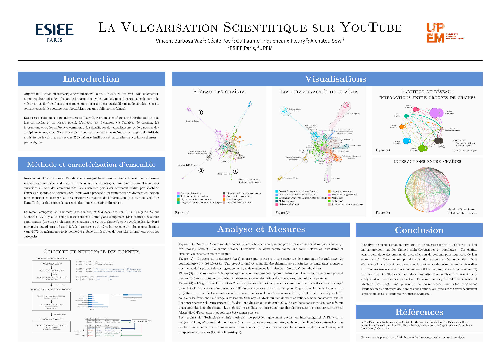

# Analyse du réseaux des chaînes YouTube culturelles et scientifiques francophones

Étude réalisée dans le cadre du cours MSH5107D encadré par Lionel Villard (enseignant-chercheur à ESIEE Paris) et Bilel Benbouzid (enseignant-chercheur à UPEM). Ce cours est à l'interface des sciences sociales et des méthodes informatiques. L'objectif est d'apprendre à analyser un réseau et d'en comprendre les métriques sous-jacentes (betweenness, degree etc.).

Auteurs :

- Vincent Barbosa Vaz, ESIEE Paris ;
- Cécile Pov, ESIEE Paris ;
- Guillaume Triqueneaux-Fleury, UPEM ;
- Aïchatou Sow, UPEM.

## Introduction

Aujourd'hui, l’essor du numérique offre un nouvel accès à la culture. En effet, non seulement il popularise les modes de diffusion de l'information (vidéo, audios), mais il participe également à la vulgarisation de disciplines peu connues ou pointues : c'est particulièrement le cas des sciences, souvent considérées comme peu abordables pour un public non-spécialisé.

Dans cette étude, nous nous sommes intéressés à la vulgarisation scientifique sur Youtube, qui est à la fois un média et un réseau social. L'objectif est d'étudier, via l'analyse de réseaux, les interactions entre les différentes communautés scientifiques de vulgarisateurs, et de discerner des disciplines émergentes. Nous avons choisis comme document de référence un rapport du ministère de la culture, qui recense 350 chaînes scientifiques et culturelles francophones classées par catégorie.

## Poster

Visualisez le poster en qualité optimale : [version pdf](MSH5107D_vulgarisation_scientifique.pdf)

---

## Références:

* Les chaînes YouTube culturelles et scientifiques francophones, Mathilde Hutin, [Rapport du ministère de la culture](https://www.culture.gouv.fr/Sites-thematiques/Langue-francaise-et-langues-de-France/Ressources/Ressources-pedagogiques-et-sensibilisation/350-ressources-culturelles-et-scientifiques-francophones-en-video)
* Dataset, Mathilde Hutin, [https://www.datastro.eu/explore/dataset/youtube-a-lecole-hutin/information](https://www.datastro.eu/explore/dataset/youtube-a-lecole-hutin/information)
* Affiche réalisée avec Inkscape, [inkscape.org](https://inkscape.org)
* Graphes générés avec Gephi, [gephi.org](https://gephi.org)
* Données collectées avec YouTube Data Tools, [https://tools.digitalmethods.net/netvizz/youtube](https://tools.digitalmethods.net/netvizz/youtube/)
